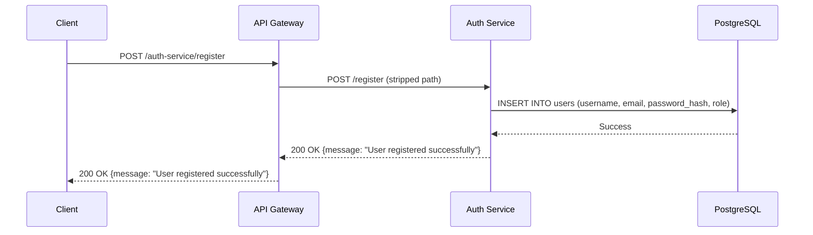
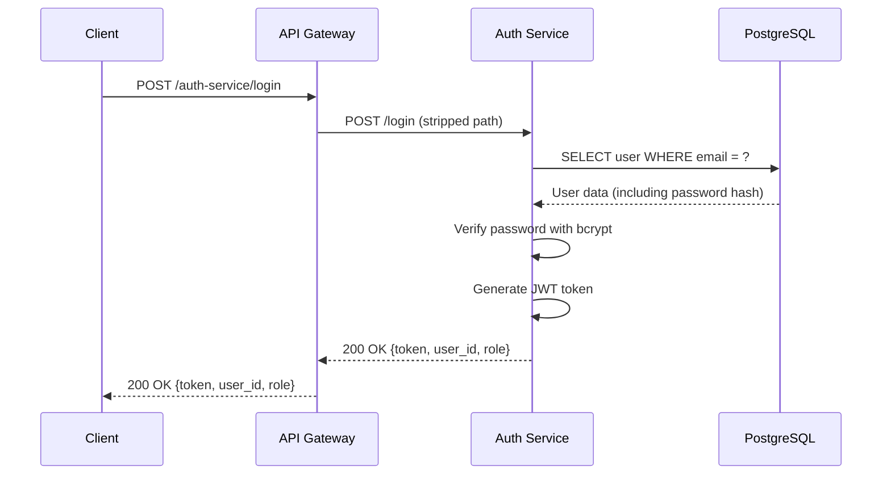
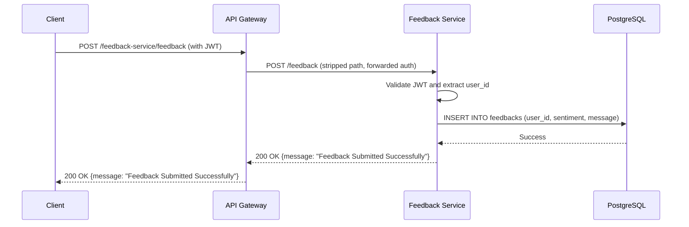
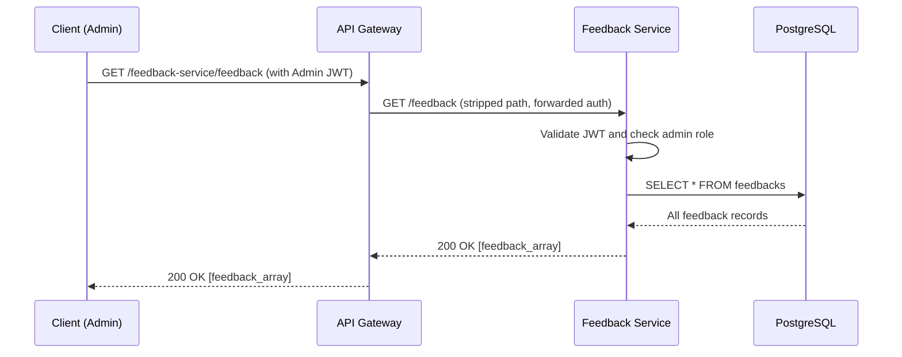

# Feedback API Microservices

A scalable microservices architecture for collecting and managing user feedback with authentication, rate limiting, and role-based access control.

## 🚀 Quick Start

### 1. Clone the Repository

```bash
git clone <your-repository-url>
cd feedback-api
```

### 2. Prerequisites

Before running the application, ensure you have the following installed:

- **Go**: Version 1.25.3 or later ([Download Go](https://golang.org/dl/))
- **PostgreSQL**: Version 12 or later ([Download PostgreSQL](https://www.postgresql.org/download/))
- **Git**: For version control ([Download Git](https://git-scm.com/downloads))

### 3. Set Up PostgreSQL Database

#### Install PostgreSQL (Ubuntu/Debian)
```bash
sudo apt update
sudo apt install postgresql postgresql-contrib
```

#### Install PostgreSQL (macOS with Homebrew)
```bash
brew install postgresql
brew services start postgresql
```

#### Install PostgreSQL (Windows)
Download and install from [postgresql.org](https://www.postgresql.org/download/windows/)

#### Create Database and User

```bash
# Connect to PostgreSQL as superuser
sudo -u postgres psql

# Create database and user (replace with your preferred credentials)
CREATE DATABASE feedback_api;
CREATE USER api_user WITH PASSWORD 'your_secure_password';
GRANT ALL PRIVILEGES ON DATABASE feedback_api TO api_user;
ALTER USER api_user CREATEDB;

# Exit PostgreSQL
\q
```

### 4. Configure Environment Variables

#### API Gateway Configuration
```bash
cd api-gateway
cp .env.example .env  # If you have an example file
```

Edit `.env`:
```env
AUTH_SERVICE=http://localhost:8002
FEEDBACK_SERVICE=http://localhost:8003
```

#### Auth Service Configuration
```bash
cd ../auth-service
cp .env.example .env  # If you have an example file
```

Edit `.env`:
```env
DB_USER=api_user
DB_PASS=your_secure_password
DB_NAME=feedback_api
DB_SSL=disable
USERNAME=admin
EMAIL=admin@yourdomain.com
PASS=admin_secure_password
```

#### Feedback Service Configuration
```bash
cd ../feedback-service
cp .env.example .env  # If you have an example file
```

Edit `.env`:
```env
DB_USER=api_user
DB_PASS=your_secure_password
DB_NAME=feedback_api
DB_SSL=disable
```

### 5. Install Dependencies and Run Services

#### Install Go Dependencies
```bash
# API Gateway
cd api-gateway
go mod tidy

# Auth Service
cd ../auth-service
go mod tidy

# Feedback Service
cd ../feedback-service
go mod tidy
```

#### Create Database Tables

The services will automatically create tables if they don't exist, but you can also run the SQL manually:

```sql
-- Users table
CREATE TABLE IF NOT EXISTS users (
    id SERIAL PRIMARY KEY,
    username VARCHAR(255) NOT NULL,
    email VARCHAR(255) UNIQUE NOT NULL,
    password TEXT NOT NULL,
    role VARCHAR(50) DEFAULT 'user'
);

-- Indexes for performance
CREATE INDEX idx_users_email ON users(email);
CREATE INDEX idx_users_role ON users(role);

-- Feedbacks table
CREATE TABLE IF NOT EXISTS feedbacks (
    id SERIAL PRIMARY KEY,
    user_id INTEGER REFERENCES users(id),
    sentiment VARCHAR(255) NOT NULL,
    message TEXT NOT NULL,
    created_at TIMESTAMP DEFAULT CURRENT_TIMESTAMP
);

-- Indexes for performance
CREATE INDEX idx_feedbacks_user_id ON feedbacks(user_id);
CREATE INDEX idx_feedbacks_sentiment ON feedbacks(sentiment);
CREATE INDEX idx_feedbacks_created_at ON feedbacks(created_at);
```

#### Run the Services

Open three terminal windows/tabs and run each service:

**Terminal 1 - API Gateway**:
```bash
cd api-gateway
go run main.go
# Server will start on http://localhost:8000
```

**Terminal 2 - Auth Service**:
```bash
cd auth-service
go run main.go
# Server will start on http://localhost:8002
# Will show "Connected to Database hehehe"
# Will show "Admin user seeded successfully"
```

**Terminal 3 - Feedback Service**:
```bash
cd feedback-service
go run main.go
# Server will start on http://localhost:8003
# Will show "Connected to Database hehehe"
```

### 6. Test the Setup

#### Register a User
```bash
curl -X POST http://localhost:8000/auth-service/register \
  -H "Content-Type: application/json" \
  -d '{
    "username": "testuser",
    "email": "test@example.com",
    "password": "testpass123"
  }'
```

#### Login
```bash
curl -X POST http://localhost:8000/auth-service/login \
  -H "Content-Type: application/json" \
  -d '{
    "email": "test@example.com",
    "password": "testpass123"
  }'
```

Copy the token from the response for the next steps.

#### Submit Feedback
```bash
curl -X POST http://localhost:8000/feedback-service/feedback \
  -H "Content-Type: application/json" \
  -H "Authorization: Bearer YOUR_TOKEN_HERE" \
  -d '{
    "sentiment": "positive",
    "message": "This API is working great!"
  }'
```

#### Admin: View All Feedback
```bash
# Use admin token (from the seeded admin user)
curl -X GET http://localhost:8000/feedback-service/feedback \
  -H "Authorization: Bearer ADMIN_TOKEN_HERE"
```

## 🏗️ Architecture Overview

This project implements a microservices architecture with the following components:

```
┌─────────────────┐    ┌──────────────────┐    ┌─────────────────┐
│   API Gateway   │───▶│   Auth Service   │    │ Feedback Service│
│   (Port 8000)   │    │   (Port 8002)    │    │  (Port 8003)    │
│                 │    │                  │    │                 │
│ • Rate Limiting │    │ • Registration   │    │ • Feedback CRUD │
│ • Reverse Proxy │    │ • Login          │    │ • Search        │
│ • Routing       │    │ • JWT Auth       │    │ • Admin Panel   │
└─────────────────┘    └──────────────────┘    └─────────────────┘
         │                       │                       │
         └───────────────────────┼───────────────────────┘
                                 │
                         ┌─────────────────┐
                         │   PostgreSQL    │
                         │   Database      │
                         └─────────────────┘
```

## 📋 Services

### 1. API Gateway Service
**Location**: `api-gateway/`
**Port**: 8000

The API Gateway acts as a single entry point for all client requests and provides:
- **Rate Limiting**: 10 requests per second with a burst capacity of 20
- **Reverse Proxy**: Routes requests to appropriate microservices
- **Request Forwarding**: Strips service prefixes and forwards to backend services

**Key Features**:
- Global rate limiting for all incoming requests
- Service discovery through environment variables
- Path-based routing (`/auth-service/*` → Auth Service, `/feedback-service/*` → Feedback Service)

### 2. Authentication Service
**Location**: `auth-service/`
**Port**: 8002

Handles user management and authentication:
- **User Registration**: Create new user accounts
- **User Login**: Authenticate users and issue JWT tokens
- **Password Security**: Bcrypt hashing for password storage
- **Admin Seeding**: Automatically creates admin user on startup

### 3. Feedback Service
**Location**: `feedback-service/`
**Port**: 8003

Manages feedback collection and administration:
- **Submit Feedback**: Authenticated users can submit feedback
- **View Feedback**: Admin-only access to all feedback
- **Search Feedback**: Search by sentiment (case-insensitive)
- **Delete Feedback**: Admin-only deletion capability

## 🔧 Technology Stack

- **Language**: Go 1.25.3
- **Framework**: Gin Web Framework
- **Database**: PostgreSQL
- **Authentication**: JWT (JSON Web Tokens)
- **Password Hashing**: bcrypt
- **Environment Management**: godotenv

### 1. API Gateway Service
**Location**: `api-gateway/`
**Port**: 8000

The API Gateway acts as a single entry point for all client requests and provides:
- **Rate Limiting**: 10 requests per second with a burst capacity of 20
- **Reverse Proxy**: Routes requests to appropriate microservices
- **Request Forwarding**: Strips service prefixes and forwards to backend services

**Key Features**:
- Global rate limiting for all incoming requests
- Service discovery through environment variables
- Path-based routing (`/auth-service/*` → Auth Service, `/feedback-service/*` → Feedback Service)

### 2. Authentication Service
**Location**: `auth-service/`
**Port**: 8002

Handles user management and authentication:
- **User Registration**: Create new user accounts
- **User Login**: Authenticate users and issue JWT tokens
- **Password Security**: Bcrypt hashing for password storage
- **Admin Seeding**: Automatically creates admin user on startup

**Database Schema**:
```sql
CREATE TABLE users (
    id SERIAL PRIMARY KEY,
    username VARCHAR(255) NOT NULL,
    email VARCHAR(255) UNIQUE NOT NULL,
    password TEXT NOT NULL,
    role VARCHAR(50) DEFAULT 'user'
);
```

### 3. Feedback Service
**Location**: `feedback-service/`
**Port**: 8003

Manages feedback collection and administration:
- **Submit Feedback**: Authenticated users can submit feedback
- **View Feedback**: Admin-only access to all feedback
- **Search Feedback**: Search by sentiment (case-insensitive)
- **Delete Feedback**: Admin-only deletion capability

**Database Schema**:
```sql
CREATE TABLE feedbacks (
    id SERIAL PRIMARY KEY,
    user_id INTEGER REFERENCES users(id),
    sentiment VARCHAR(255) NOT NULL,
    message TEXT NOT NULL
);
```

## 🔧 Technology Stack

- **Language**: Go 1.25.3
- **Framework**: Gin Web Framework
- **Database**: PostgreSQL
- **Authentication**: JWT (JSON Web Tokens)
- **Password Hashing**: bcrypt
- **Environment Management**: godotenv

## 🚀 Quick Start

### Prerequisites
- Go 1.25.3 or later
- PostgreSQL database
- Git

### Installation

1. **Clone the repository**:
```bash
git clone <your-repo-url>
cd feedback-api
```

2. **Set up the database**:
Create a PostgreSQL database and note the connection details.

3. **Configure environment variables**:

**API Gateway** (`.env`):
```env
AUTH_SERVICE=http://localhost:8002
FEEDBACK_SERVICE=http://localhost:8003
```

**Auth Service** (`.env`):
```env
DB_USER=your_db_user
DB_PASS=your_db_password
DB_NAME=your_db_name
DB_SSL=disable
USERNAME=admin_username
EMAIL=admin@example.com
PASS=admin_password
```

**Feedback Service** (`.env`):
```env
DB_USER=your_db_user
DB_PASS=your_db_password
DB_NAME=your_db_name
DB_SSL=disable
```

4. **Install dependencies and run services**:

**API Gateway**:
```bash
cd api-gateway
go mod tidy
go run main.go
```

**Auth Service**:
```bash
cd ../auth-service
go mod tidy
go run main.go
```

**Feedback Service**:
```bash
cd ../feedback-service
go mod tidy
go run main.go
```

## 📡 API Endpoints

### Authentication Service Endpoints

#### Register User
**Endpoint**: `POST /auth-service/register`
**Description**: Register a new user account

**Request Body**:
```json
{
  "username": "string (required)",
  "email": "string (required, must be unique)",
  "password": "string (required)"
}
```

**Response** (200 OK):
```json
{
  "message": "User registered successfully"
}
```

**Error Responses**:
- `400 Bad Request`: Invalid JSON or missing fields
- `500 Internal Server Error`: Database error

#### Login User
**Endpoint**: `POST /auth-service/login`
**Description**: Authenticate user and receive JWT token

**Request Body**:
```json
{
  "email": "string (required)",
  "password": "string (required)"
}
```

**Response** (200 OK):
```json
{
  "message": "Login successful",
  "user_id": "integer",
  "role": "string (user or admin)",
  "token": "jwt_token_string"
}
```

**Error Responses**:
- `400 Bad Request`: Invalid credentials or malformed JSON
- `500 Internal Server Error`: Server error

### Feedback Service Endpoints

All feedback endpoints require authentication via JWT token in the Authorization header.

#### Submit Feedback
**Endpoint**: `POST /feedback-service/feedback`
**Description**: Submit new feedback (authenticated users only)
**Required Role**: Any authenticated user

**Request Body**:
```json
{
  "sentiment": "string (required) - e.g., 'positive', 'negative', 'neutral'",
  "message": "string (required) - feedback content"
}
```

**Response** (200 OK):
```json
{
  "message": "Feedback Submitted Successfully"
}
```

**Error Responses**:
- `401 Unauthorized`: Missing or invalid JWT token
- `500 Internal Server Error`: Failed to bind JSON or database error

#### Get All Feedback
**Endpoint**: `GET /feedback-service/feedback`
**Description**: Retrieve all feedback entries (admin only)
**Required Role**: Admin

**Response** (200 OK):
```json
[
  {
    "id": "integer",
    "user_id": "integer",
    "sentiment": "string",
    "message": "string"
  },
  {
    "id": "integer",
    "user_id": "integer",
    "sentiment": "string",
    "message": "string"
  }
]
```

**Error Responses**:
- `401 Unauthorized`: Missing/invalid token or insufficient permissions
- `500 Internal Server Error`: Database query error

#### Get Feedback by ID
**Endpoint**: `GET /feedback-service/feedback/{id}`
**Description**: Retrieve specific feedback by ID (admin only)
**Required Role**: Admin
**Path Parameters**:
- `id` (integer): Feedback ID

**Response** (200 OK):
```json
{
  "id": "integer",
  "user_id": "integer",
  "sentiment": "string",
  "message": "string"
}
```

**Error Responses**:
- `401 Unauthorized`: Missing/invalid token or insufficient permissions
- `404 Not Found`: Feedback with specified ID not found
- `500 Internal Server Error`: Database query error or invalid ID format

#### Search Feedback
**Endpoint**: `GET /feedback-service/feedback/search?q={query}`
**Description**: Search feedback by sentiment (case-insensitive) (admin only)
**Required Role**: Admin
**Query Parameters**:
- `q` (string): Search term to match against sentiment field

**Response** (200 OK):
```json
[
  {
    "id": "integer",
    "user_id": "integer",
    "sentiment": "string",
    "message": "string"
  }
]
```

**Error Responses**:
- `401 Unauthorized`: Missing/invalid token or insufficient permissions
- `500 Internal Server Error`: Database query error

#### Delete Feedback
**Endpoint**: `DELETE /feedback-service/feedback/{id}`
**Description**: Delete specific feedback by ID (admin only)
**Required Role**: Admin
**Path Parameters**:
- `id` (integer): Feedback ID to delete

**Response** (200 OK):
```json
{
  "message": "Feedback Deleted Successfully"
}
```

**Error Responses**:
- `401 Unauthorized`: Missing/invalid token or insufficient permissions
- `500 Internal Server Error`: Database error or invalid ID format

## 🔐 Authentication

Most endpoints require JWT authentication. Include the token in the Authorization header:

```
Authorization: Bearer <your_jwt_token>
```

Tokens are obtained by calling the login endpoint and expire after 5 hours.

## 🔒 Role-Based Access Control

The API implements role-based access control:

- **User Role**:
  - Can submit feedback
  - Cannot view, search, or delete feedback

- **Admin Role**:
  - Can submit feedback (inherited from user)
  - Can view all feedback
  - Can search feedback
  - Can delete feedback

## ⚠️ Error Handling

All endpoints follow consistent error response formats:

**Authentication Errors** (401):
```json
{
  "error": "Unauthorized try to Login"
}
```

**Authorization Errors** (401):
```json
{
  "error": "Unauthorized you must be admin to acces this page hehehe"
}
```

**Not Found Errors** (404):
```json
{
  "error": "Feedback Not Found"
}
```

**Validation Errors** (400):
```json
{
  "error": "Failed to Bind JSON"
}
```

**Server Errors** (500):
```json
{
  "error": "Failed to Query Feedbacks"
}
```

## 📊 Rate Limiting

The API Gateway implements rate limiting:
- **Limit**: 10 requests per second
- **Burst**: 20 requests
- **Exceeded Response** (429):
```json
{
  "error": "Too many requests"
}
```

## 🔧 Middleware

### Authentication Middleware
- Validates JWT tokens
- Extracts user ID and role from token
- Attaches user context to request

### Admin Middleware
- Checks if user has admin role
- Must be used after authentication middleware

### Rate Limiting Middleware
- Applied globally to all requests through API Gateway
- Uses token bucket algorithm

## 💾 Database Schema

### Users Table
```sql
CREATE TABLE users (
    id SERIAL PRIMARY KEY,
    username VARCHAR(255) NOT NULL,
    email VARCHAR(255) UNIQUE NOT NULL,
    password TEXT NOT NULL,
    role VARCHAR(50) DEFAULT 'user'
);
```

### Feedbacks Table
```sql
CREATE TABLE feedbacks (
    id SERIAL PRIMARY KEY,
    user_id INTEGER REFERENCES users(id),
    sentiment VARCHAR(255) NOT NULL,
    message TEXT NOT NULL
);
```

## 🔑 JWT Token Structure

Tokens contain the following claims:
```json
{
  "user_id": "integer",
  "role": "string",
  "exp": "numeric_date"
}
```

## 🚀 Usage Examples

### Register a New User
```bash
curl -X POST http://localhost:8000/auth-service/register \
  -H "Content-Type: application/json" \
  -d '{
    "username": "johndoe",
    "email": "john@example.com",
    "password": "securepassword"
  }'
```

### Login and Get Token
```bash
curl -X POST http://localhost:8000/auth-service/login \
  -H "Content-Type: application/json" \
  -d '{
    "email": "john@example.com",
    "password": "securepassword"
  }'
```

### Submit Feedback (using token from login)
```bash
curl -X POST http://localhost:8000/feedback-service/feedback \
  -H "Content-Type: application/json" \
  -H "Authorization: Bearer YOUR_JWT_TOKEN" \
  -d '{
    "sentiment": "positive",
    "message": "Great service!"
  }'
```

### Get All Feedback (admin only)
```bash
curl -X GET http://localhost:8000/feedback-service/feedback \
  -H "Authorization: Bearer ADMIN_JWT_TOKEN"
```

## 📈 Best Practices

1. **Always include Authorization header** for authenticated endpoints
2. **Handle rate limiting** by implementing retry logic with exponential backoff
3. **Store JWT tokens securely** and handle token expiration
4. **Validate input data** on client side before sending requests
5. **Use admin endpoints carefully** as they have elevated privileges

## 🔍 Troubleshooting

**Common Issues**:
- **401 Unauthorized**: Check JWT token validity and Authorization header format
- **429 Too Many Requests**: Implement rate limiting handling in your client
- **500 Internal Server Error**: Check server logs for detailed error information
- **404 Not Found**: Verify endpoint URLs and resource IDs


```

### Database Migrations

For future schema changes, implement migrations:

```bash
# Using golang-migrate (recommended)
migrate -path ./migrations -database $DATABASE_URL up

# Or use SQL files
psql -h localhost -U api_user -d feedback_api -f migrations/001_initial_schema.sql
```

## 🔒 Security Features

- **Rate Limiting**: Prevents abuse with 10 requests/second limit
- **JWT Authentication**: Stateless token-based authentication
- **Password Hashing**: Secure bcrypt hashing for passwords
- **Role-Based Access**: Admin vs user permissions
- **Input Validation**: JSON binding with error handling

## 📊 Database Setup

Execute the following SQL to set up the database:

```sql
-- Users table
CREATE TABLE users (
    id SERIAL PRIMARY KEY,
    username VARCHAR(255) NOT NULL,
    email VARCHAR(255) UNIQUE NOT NULL,
    password TEXT NOT NULL,
    role VARCHAR(50) DEFAULT 'user'
);

-- Indexes for performance
CREATE INDEX idx_users_email ON users(email);
CREATE INDEX idx_users_role ON users(role);

-- Feedbacks table
CREATE TABLE feedbacks (
    id SERIAL PRIMARY KEY,
    user_id INTEGER REFERENCES users(id),
    sentiment VARCHAR(255) NOT NULL,
    message TEXT NOT NULL
);


## 🔄 Data Flow Diagrams

### User Registration Flow



### User Login Flow



### Feedback Submission Flow



### Admin View Feedback Flow




